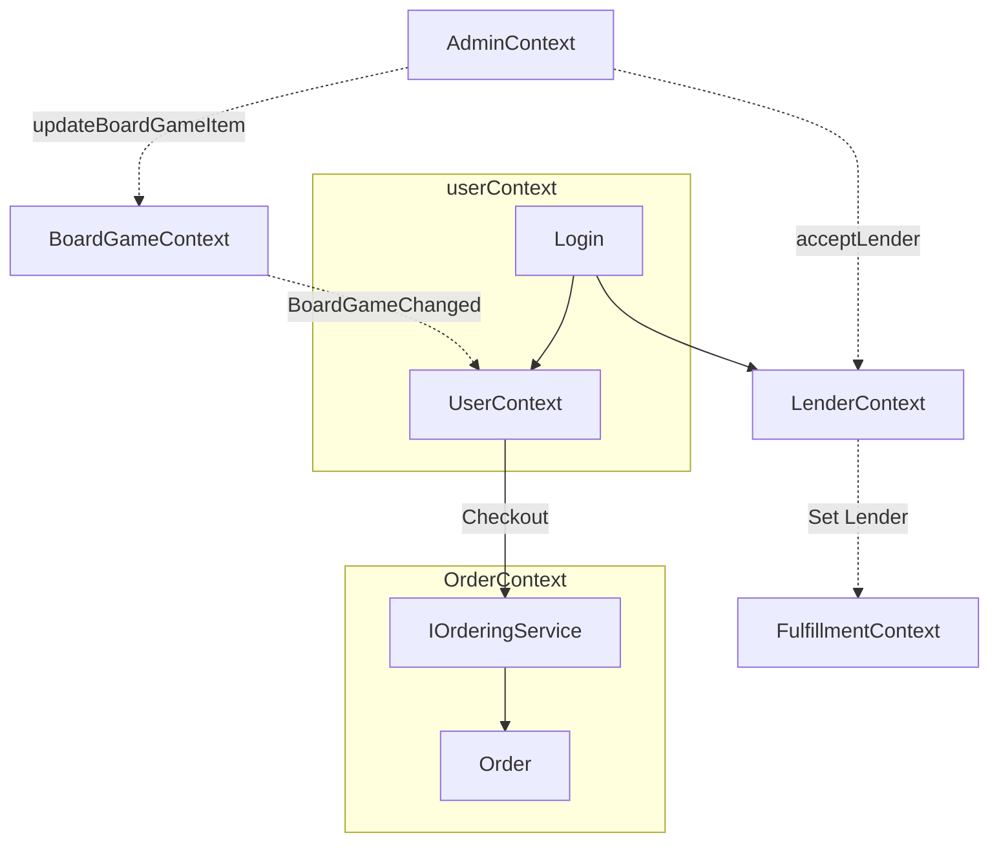

### 2.1 System diagram

```mermaid
flowchart TB
 subgraph OrderContext["OrderContext"]
        Order["Order"]
        IOrderingService["IOrderingService"]
  end
  subgraph userContext
    login[Login] 
    login --> user[UserContext] 
  end
    
    login --> Lender[LenderContext]  

    admin[AdminContext] -. updateBoardGameItem .-> BoardGameContext
    admin -. acceptLender .-> Lender

    BoardGameContext["BoardGameContext"] -. BoardGameChanged .-> user
    user -- Checkout --> IOrderingService
    IOrderingService --> Order

    Lender -. Set Lender .-> FulfillmentContext

    

```