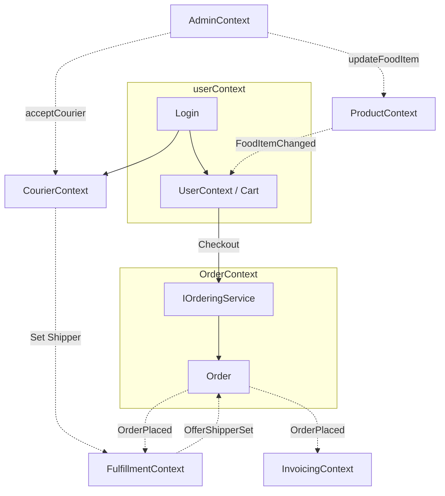

### 2.1 System diagram

```mermaid
flowchart TB
 subgraph OrderContext["OrderContext"]
        Order["Order"]
        IOrderingService["IOrderingService"]
  end
  subgraph userContext
    login[Login] 
    login --> user[UserContext / Cart] 
  end
    
    login --> courier[CourierContext]  

    admin[AdminContext] -. updateFoodItem .-> ProductContext
    admin -. acceptCourier .-> courier

    ProductContext["ProductContext"] -. FoodItemChanged .-> user
    user -- Checkout --> IOrderingService
    IOrderingService --> Order

    courier -. Set Shipper .-> FulfillmentContext

    Order -. OrderPlaced .-> FulfillmentContext["FulfillmentContext"] & InvoicingContext["InvoicingContext"]
    FulfillmentContext -. OfferShipperSet .-> Order

```